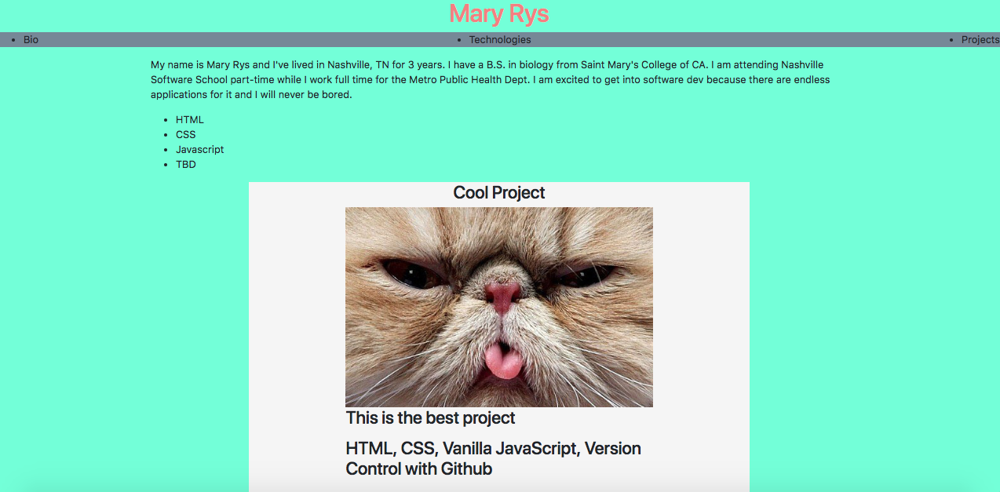

# personal-bio-site

### Description
This website is a biography of myself and my projects at Nashville Software School.

### Screenshot(s)

### Instructions
<li>Use npm to install http-server in your terminal: 
npm install -g http-server
<li>Run the server in your terminal
hs -p 9999
<li>Open chrome and navigate to: 
localhost:9999
